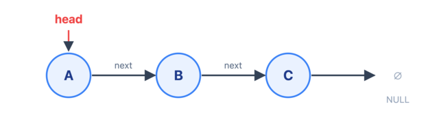
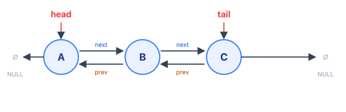
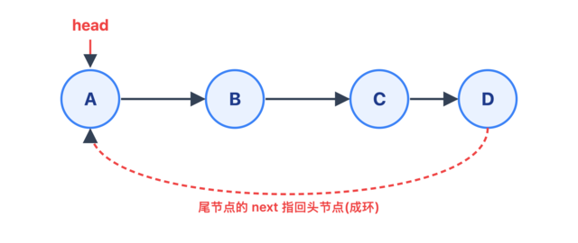

## Summary

如果说数组的灵魂是**连续存储**,那链表的灵魂就是它的反面——**用一根"指针"把散落在内存各处的节点串起来**。这一个设计上的取舍,换来了数组梦寐以求的能力:在任意位置插入、删除只要改几个指针,O(1) 就能完成,不用像数组那样搬动后面一大片元素。代价也同样直接:失去了 O(1) 随机访问,想找第 `i` 个节点只能从头一步步走;而且节点散落、对缓存不友好,遍历常常比数组慢好几倍。

链表本身简单,但它是**栈、队列、哈希表拉链、LRU、时间轮、内核/运行时的侵入式链表**的地基,也是"快慢指针、反转、判环"这一整套指针技巧的练兵场。这篇按 **单链表 → 双链表 → 循环链表** 展开,最后落到 Go 标准库的 `container/list` 和几个必会的算法范式。

---

## 链表 vs 数组:内存模型的对立

数组在内存里是一整块连续区域,靠 `base + i * size` 一步算出地址;链表恰恰相反,每个节点是**独立 malloc 出来的一小块内存**,彼此物理上不相邻,只靠节点里存的一个**指针(地址)**知道"下一个在哪":

```
数组:  一整块连续内存,下标即地址偏移
       ┌────┬────┬────┬────┐
       │ A  │ B  │ C  │ D  │   → a[i] = base + i*size,O(1)
       └────┴────┴────┴────┘

链表:  节点散落各处,靠指针串联
       [A|·]───→[B|·]───→[C|·]───→ ∅
       0x1a0     0x3f8     0x0c0   (地址无规律)
```

这个区别直接决定了两者的性能对立面:

| | 数组 | 链表 |
|---|---|---|
| 随机访问第 i 个 | **O(1)** | O(n),从头走 |
| 头部插入/删除 | O(n),要搬后面所有元素 | **O(1)**,改指针即可 |
| 已知位置插入/删除 | O(n) | **O(1)**(双链表) |
| 内存开销 | 紧凑 | 每个节点**额外**存 1~2 个指针 |
| 缓存友好度 | 高(空间局部性) | 低,几乎每跳一次都可能 cache miss |
| 扩容 | 可能触发整体拷贝 | 天然按需增长,不搬家 |

---

## 节点长什么样

链表的一切都从"节点"这个结构体开始。一个节点 = **数据** + **指向下一个节点的指针**:

```go
type Node struct {
    Val  int
    Next *Node // 指针:存的是下一个节点的内存地址,nil 表示到头了
}
```

`Next` 是一个**指针**,不是"下一个节点本身"。正因为存的是地址,插入/删除时我们改的只是这几个 8 字节的地址值,而不用动节点里的数据——这就是链表 O(1) 增删的物理原因。

---

## 单链表(Singly Linked List)

最基础的形态:每个节点只有一个 `Next` 指针,只能**从头往尾单向走**。一个 `head` 指针记住入口,尾节点的 `Next` 指向 `nil`(下图用 `∅` 表示)。



### 增删为什么是 O(1)

链表增删快,快在"只改指针、不搬数据"。在节点 `p` 后面插入一个新节点 `x`,只有两行:

```go
x.Next = p.Next  // ① 新节点接上 p 的后继
p.Next = x       // ② p 改为指向新节点
```

```
插入前:  p ───→ q
插入后:  p ──→ x ──→ q     只动了两根指针,和链表多长无关 → O(1)
```

删除 `p` 的后继同理,一行绕过去即可,被删节点等着被 GC 回收:

```go
p.Next = p.Next.Next
```

**但有个隐藏前提:你得先"站在"要操作的位置的前一个节点上。** 单链表只能从头找,所以"找到第 i 个位置"本身是 O(n)——这也是单链表最大的软肋:**知道位置后操作 O(1),但找到位置要 O(n)。**

### 头节点难处理?用哨兵(dummy head)

单链表所有增删都需要"前驱节点",可**头节点没有前驱**,于是"删头""在头前插入"都要写特殊分支。工程上的通用解法是加一个**哨兵节点(dummy / sentinel)**:一个不存数据、永远在最前面的假头,让真正的第一个节点也有前驱,所有操作就统一了,代码里再也没有 `if 是头节点` 的分支。

```go
func removeElements(head *Node, val int) *Node {
    dummy := &Node{Next: head} // 哨兵:统一处理"删头"这种边界
    prev := dummy
    for prev.Next != nil {
        if prev.Next.Val == val {
            prev.Next = prev.Next.Next // 删除,不用管是不是头节点
        } else {
            prev = prev.Next
        }
    }
    return dummy.Next // 哨兵的下一个才是真正的新头
}
```

> 哨兵节点是链表题的第一反射:**只要涉及可能删/插头节点,先 `dummy := &Node{Next: head}`。** 后面 LRU、合并链表也都靠它省掉边界判断。

---

## 双链表(Doubly Linked List)

单链表只能往前走,想删掉"当前节点"却拿不到它的前驱(必须从头再找一遍)。**双链表**给每个节点再加一个 `Prev` 指针,前后都能走:

```go
type DNode struct {
    Val  int
    Prev *DNode // 指向前一个
    Next *DNode // 指向后一个
}
```



每两个相邻节点之间有**两根线**:上面一根是 `next`(向右),下面一根是 `prev`(向左)。首节点的 `prev` 和尾节点的 `next` 都指向 `nil`。

### 双链表的价值:任意节点 O(1) 删除

单链表删除一个"手里已经拿到的节点 `p`"是 O(1) 吗?**不是**——你还得从头找到 `p` 的前驱才能改它的 `Next`,所以是 O(n)。双链表因为能 `p.Prev` 直接拿到前驱,**真正做到 O(1) 删除任意已知节点**:

```go
func remove(p *DNode) {
    p.Prev.Next = p.Next // 前驱越过 p 指向后继
    p.Next.Prev = p.Prev // 后继的前驱指回前驱
}
```

```
删除前:  ... ⇄ prev ⇄ [p] ⇄ next ⇄ ...
删除后:  ... ⇄ prev ⇄ next ⇄ ...      p 被两边同时"绕过"
```

**这正是 LRU 缓存的核心。** LRU 需要:命中时把某个节点挪到最前(O(1) 删 + O(1) 插),满了淘汰最后一个(O(1))。哈希表负责"O(1) 定位到节点",双链表负责"O(1) 调整顺序",二者配合就是标准 LRU:

```go
type entry struct {
    key, val   int
    prev, next *entry
}

type LRUCache struct {
    cap        int
    m          map[int]*entry // key → 节点,O(1) 定位
    head, tail *entry         // 两个哨兵:head 侧最新,tail 侧最旧
}

func Constructor(capacity int) LRUCache {
    h, t := &entry{}, &entry{}
    h.next, t.prev = t, h // 两个哨兵首尾相接,链表永不为"空"
    return LRUCache{cap: capacity, m: map[int]*entry{}, head: h, tail: t}
}

func (c *LRUCache) remove(e *entry) {
    e.prev.next, e.next.prev = e.next, e.prev
}

func (c *LRUCache) pushFront(e *entry) {
    e.prev, e.next = c.head, c.head.next
    c.head.next.prev, c.head.next = e, e
}

func (c *LRUCache) Get(key int) int {
    if e, ok := c.m[key]; ok {
        c.remove(e)     // 命中:先摘下
        c.pushFront(e)  // 再挪到最前,标记为"最近使用"
        return e.val
    }
    return -1
}

func (c *LRUCache) Put(key, val int) {
    if e, ok := c.m[key]; ok {
        e.val = val
        c.remove(e)
        c.pushFront(e)
        return
    }
    if len(c.m) == c.cap { // 满了:淘汰 tail 前面那个(最旧)
        oldest := c.tail.prev
        c.remove(oldest)
        delete(c.m, oldest.key)
    }
    e := &entry{key: key, val: val}
    c.m[key] = e
    c.pushFront(e)
}
```

代价是每个节点多存一个指针(内存 +8 字节),以及每次增删要多维护一根 `Prev`。**用空间和一点点常数换"双向可走"**,几乎所有需要频繁在中间增删的场景都值。

---

## 循环链表(Circular Linked List)

把尾节点的 `Next` 从 `nil` 改成**指回头节点**,链表就首尾相接成了一个环——**循环链表**。从任意节点出发,一直走 `Next` 永远不会遇到 `nil`,而是会绕回起点。



它可以是单向环(尾 `next` → 头),也可以是双向环(再让头 `prev` → 尾)。判断"走完一圈"的方法不再是 `p == nil`,而是 `p == head`(或回到出发节点):

```go
p := head
for {
    // 处理 p
    p = p.Next
    if p == head { // 回到起点 = 走完一圈
        break
    }
}
```

### 它解决什么问题

循环链表天生适合**环形、轮转、周而复始**的场景:

- **约瑟夫环(Josephus)**:N 人围成圈报数,每数到 M 出局,问最后剩谁。用循环链表直接建模,数到就删节点,删到只剩一个:

```go
func josephus(n, m int) int {
    // 建环:1..n
    head := &Node{Val: 1}
    cur := head
    for i := 2; i <= n; i++ {
        cur.Next = &Node{Val: i}
        cur = cur.Next
    }
    cur.Next = head // 尾接头,成环

    prev := cur // prev 始终是 cur 的前驱,方便删除
    for prev.Next != prev { // 还剩 >1 个节点
        for i := 1; i < m; i++ { // 数 m-1 步,prev 停在第 m 个的前驱
            prev = prev.Next
        }
        prev.Next = prev.Next.Next // 删掉第 m 个
    }
    return prev.Val // 只剩它自己
}
```

- **循环队列 / 环形缓冲(ring buffer)**:生产者写、消费者读,空间循环利用——这在数组篇也见过(数组 + 取模),链表版就是循环链表。
- **时间轮(timing wheel)**:Kafka、Netty、Linux 内核的定时器调度,把时间槽排成一个环,指针一格格转,到点触发该槽里的任务,是海量定时任务的经典结构。
- **轮询调度(round-robin)**:负载均衡里轮流把请求发给一组后端,转一圈回到第一个。

---

## 复杂度速查

| 操作 | 单链表 | 双链表 | 数组(对照) |
|---|---|---|---|
| 按下标访问第 i 个 | O(n) | O(n) | **O(1)** |
| 头部插入 / 删除 | **O(1)** | **O(1)** | O(n) |
| 尾部插入(有 tail 指针) | **O(1)** | **O(1)** | O(1) 均摊 |
| 删除"已拿到的节点 p" | O(n)(要找前驱) | **O(1)** | O(n) |
| 查找某个值 | O(n) | O(n) | O(n) |
| 额外空间/节点 | 1 个指针 | 2 个指针 | 无 |

一句话:**链表牺牲随机访问,换取任意位置的高效增删;双链表再花一个指针,换"任意已知节点 O(1) 删除"。**

---

## 必会的链表算法范式

链表题的套路高度集中,核心就是**指针的腾挪**。下面几个是面试和工程里反复出现的。

### 快慢指针 · 找中点

一个指针一次走一步,另一个一次走两步。快指针到头时,慢指针正好在中点。找中点、判断回文链表都靠它:

```go
func middleNode(head *Node) *Node {
    slow, fast := head, head
    for fast != nil && fast.Next != nil {
        slow = slow.Next      // 走一步
        fast = fast.Next.Next // 走两步
    }
    return slow // fast 到头,slow 在中间
}
```

### 快慢指针 · Floyd 判环(龟兔赛跑)

如何判断一个链表里有没有环?快慢指针在环里一定会相遇(快的追上慢的);若无环,快指针先到 `nil`。这就是著名的 **Floyd 判圈算法**:

```go
func hasCycle(head *Node) bool {
    slow, fast := head, head
    for fast != nil && fast.Next != nil {
        slow = slow.Next
        fast = fast.Next.Next
        if slow == fast { // 相遇 = 有环
            return true
        }
    }
    return false
}
```

进阶:相遇后,把其中一个指针放回 `head`,两个指针都改成一次一步同速前进,再次相遇处就是**环的入口**(可用数学证明)。

### 反转链表

链表题的"必考基本功"。三个指针 `prev / cur / next` 依次把每根 `Next` 掉头:

```go
func reverseList(head *Node) *Node {
    var prev *Node
    cur := head
    for cur != nil {
        next := cur.Next // 先存住后继,不然掉头后就找不到了
        cur.Next = prev  // 掉头:指向前一个
        prev = cur       // prev、cur 各前进一步
        cur = next
    }
    return prev // 原来的尾,现在是新头
}
```

```
反转前:  A → B → C → ∅
反转后:  ∅ ← A ← B ← C   返回 C 作为新 head
```

### 合并两个有序链表

归并排序在链表上的一步。用哨兵起头,谁小接谁:

```go
func mergeTwoLists(l1, l2 *Node) *Node {
    dummy := &Node{}
    tail := dummy
    for l1 != nil && l2 != nil {
        if l1.Val <= l2.Val {
            tail.Next, l1 = l1, l1.Next
        } else {
            tail.Next, l2 = l2, l2.Next
        }
        tail = tail.Next
    }
    if l1 != nil { // 把剩下的一整段直接接上
        tail.Next = l1
    } else {
        tail.Next = l2
    }
    return dummy.Next
}
```

> 链表**天生适合归并排序**:合并两段是 O(1) 空间的指针拼接,不像数组归并要开辅助数组。这也是为什么链表排序首选归并而不是快排。

---

## Go 标准库:`container/list`

Go 其实自带了一个开箱即用的链表——`container/list`,而且它的实现恰好把本文三个概念**合到了一起:它是一个带哨兵的「双向循环链表」**。理解了前面,再看它的设计会非常顺:

它的内部结构印证了本文所有要点:

```go
type List struct {
    root Element
    len  int
}

type Element struct {
    next, prev *Element // 双向:两个指针
    list       *List
    Value      any
}

func (l *List) Init() *List {
	l.root.next = &l.root
	l.root.prev = &l.root
	l.len = 0
	return l
}

func (l *List) Remove(e *Element) any {
	if e.list == l {
		// if e.list == l, l must have been initialized when e was inserted
		// in l or l == nil (e is a zero Element) and l.remove will crash
		l.remove(e)
	}
	return e.Value
}


func (l *List) remove(e *Element) { //这段正是之前双向链表的删除代码实现
	e.prev.next = e.next
	e.next.prev = e.prev
	e.next = nil // avoid memory leaks
	e.prev = nil // avoid memory leaks
	e.list = nil
	l.len--
}
```

设计上的三个巧思,全是前面讲过的东西:

1. **哨兵 `root`**:空链表时 `root.next` 和 `root.prev` 都指向 `root` 自己,永远不为 `nil`,所有增删不用判空、不用管边界。
2. **循环**:首尾都连到 `root`,`Front()` 就是 `root.next`,`Back()` 就是 `root.prev`,O(1) 拿到两端。
3. **双向**:`Remove(e)` 能直接靠 `e.prev`、`e.next` 把自己摘掉,**O(1)**——正是双链表的看家本领。
