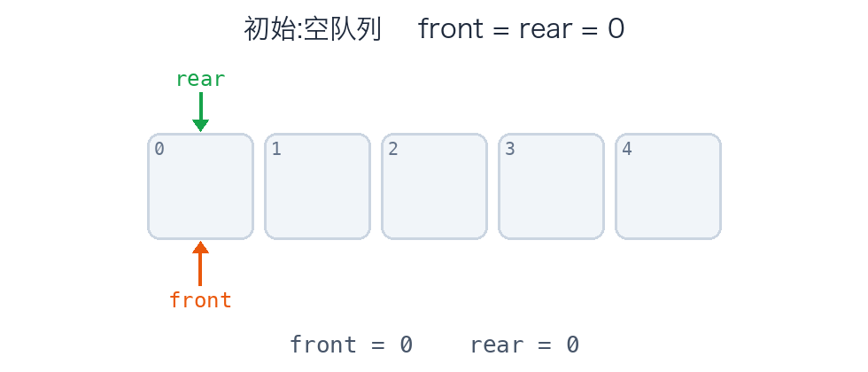

## Summary

堆栈和队列是一种特殊的线性结构，同时也是一种受限的数据结构，堆栈的处理顺序是“最近发生的，最先处理”，也就是我们常说的先进后出 LIFO（Last In First Out）这种顺序处理通常适合回退、DFS、函数调用栈；队列的处理顺序是“先来的先服务”，也就是先进先出 FIFO（First In First Out），这种顺序处理通常放到任务调度、消息中间件、BFS（广度优先搜索）。

## 堆栈

这里说的堆栈其实就是栈这个数据结构，这里有必要解释一下，因为堆这个术语有很多地方在使用，容易造成术语撞车。

1. "堆栈":它就等于"栈(stack)"

中文里的 "堆栈"是 stack 的历史直译，是一个双字词，整体指的就是栈(后进先出，LIFO)。里面那个"堆"字没有独立含义，只是凑成词，它既不是队列，也不是"堆数据结构"。

所以讲"函数调用堆栈" "堆栈溢出(stack overflow)"时，说的都是栈。"堆栈里的堆"本身不是一个单独的结构

2. "堆(heap)" 单独出现时，有两个完全不同的意思

- 内存的堆(heap memory):程序运行时动态分配内存的区域(Go 里 new/逃逸到堆上的对象)。它和"栈内存(存局部变量、函数帧)"相对。这个"堆"和数据结构的堆没有任何关系，纯粹是术语撞车。
- 数据结构的堆(heap，二叉堆):一棵完全二叉树。

3. 数据结构的堆 ≈ 优先队列，但不是普通队列

- 普通队列(queue):先进先出(FIFO)，谁先来谁先走。
- 堆:它实现的是 优先队列(priority queue) 这种抽象——出队的不是最早进来的，而是优先级最高/最低的那个(最大堆出最大值，最小堆出最小值)。

### 核心操作

先进后出，就像是在摞盘子，你只能往最上面放，拿的时候也只能从最上面拿。

两个核心操作:

- **入栈 push**:把元素放到栈顶。
- **出栈 pop**:取出并移除栈顶元素。

辅助操作:**peek**(只看栈顶不取出)、**isEmpty**(是否为空)、**size**(元素个数)。

```
        push ↓   ↑ pop
              ┌─────┐
栈顶 top ───▶  │  30 │  ← 最后进，最先出
              ├─────┤
              │  20 │
              ├─────┤
栈底 bottom ─▶ │  10 │  ← 最先进，最后出
              └─────┘
```

**所有核心操作都是 O(1)**——只操作栈顶，不涉及其他元素。

### 两种实现:数组栈 vs 链表栈

#### 数组栈

```go
type ArrayStack struct {
	data []any
}

func NewArrayStack() *ArrayStack {
	return &ArrayStack{data: make([]any， 0)}
}

func (s *ArrayStack) Push(v any) {
	s.data = append(s.data， v)
}

func (s *ArrayStack) Pop() any {
	if s.IsEmpty() {
		return nil
	}
	v := s.data[len(s.data)-1]
	s.data = s.data[:len(s.data)-1]
	return v
}

func (s *ArrayStack) Peek() any {
	if len(s.data) == 0 {
		return nil
	}
	return s.data[len(s.data)-1]
}

func (s *ArrayStack) IsEmpty() bool {
	return len(s.data) == 0
}
```

#### 链表栈

```go
type ListStack struct {
	Val  any
	Next *ListStack
}

func NewListStack() *ListStack {
	return &ListStack{Next: nil}
}

func (s *ListStack) Push(v any) {
	s.Next = &ListStack{Next: s.Next， Val: v}
}

func (s *ListStack) Pop() any {
	if s.IsEmpty() {
		return nil
	}
	v := s.Next.Val
	s.Next = s.Next.Next
	return v
}

func (s *ListStack) Peek() any {
	if s.IsEmpty() {
		return nil
	}
	return s.Next.Val
}

func (s *ListStack) IsEmpty() bool {
	return s.Next == nil
}type ListStack struct {
	Val  any
	Next *ListStack
}

func NewListStack() *ListStack {
	return &ListStack{Next: nil}
}

func (s *ListStack) Push(v any) {
	s.Next = &ListStack{Next: s.Next， Val: v}
}

func (s *ListStack) Pop() any {
	if s.IsEmpty() {
		return nil
	}
	v := s.Next.Val
	s.Next = s.Next.Next
	return v
}

func (s *ListStack) Peek() any {
	if s.IsEmpty() {
		return nil
	}
	return s.Next.Val
}

func (s *ListStack) IsEmpty() bool {
	return s.Next == nil
}
```

> 其实感觉用数组实现栈还挺好的

### 重要应用:函数调用栈

这是栈最深刻的应用，也是我们每天都在用的但是却没意识到的。

**程序运行时，函数调用是用栈管理的** 每调用一个函数，就把它的局部变量、参数、返回地址打包成一个"栈帧(stack frame)"，**push** 到调用栈上;函数返回时，栈帧 **pop** 出去。这完美契合 LIFO:最后被调用的函数，最先返回。

```
main() 调用 a()，a() 调用 b():

调用栈(从底往上生长):
┌─────────┐ ← 栈顶，当前正在执行 b
│  b 的帧  │
├─────────┤
│  a 的帧  │
├─────────┤
│ main 帧  │ ← 栈底
└─────────┘
b 返回 → 弹出 b 的帧 → 回到 a
```

如果函数调用链写的过长，比如递归，调用栈会变得很大，导致最后被压爆，就是 `stack overflow`。

### 动手练习(LeetCode)

-  20.有效的括号(必做)
-  155.最小栈(设计，O(1) 取最小值)
-  150.逆波兰表达式求值(栈求值)
-  232.用栈实现队列(理解栈和队列的转换)
-  739.每日温度(单调栈入门)

## 队列

### 核心操作

先进先出(FIFO)

```
   入队 enqueue                          出队 dequeue
        ↓                                    ↓
   队尾 rear                            队头 front
     ┌────┬────┬────┬────┐
 ──▶ │ 40 │ 30 │ 20 │ 10 │ ──▶ 10 先出(它最先进来)
     └────┴────┴────┴────┘
```

核心操作 enqueue / dequeue 都应是 O(1)。辅助操作:peek(看队头)、isEmpty、size。

### 实现

#### 使用数组实现

需要两个下标，一个记录front的位置，一个记录rear的位置，入队rear++，出队front++，当rear到达数组的尾端时，说明这个队列满了，但是如果出队的话，这个队列就会有空位出现，逻辑上没满，但是下标却到头了。

例如下图 ： 



如果每次出队都把后面元素整体前移一格来复用空间，那出队就变成 O(n)，违背了队列 O(1) 的初衷。

#### 使用循环数组实现

让rear这个下标绕回来，形成循环数组

```go
rear = (rear + 1) % capacity
front = (front + 1) % capacity
```

```go
type CycleQueue struct {
	data  []any
	front int
	rear  int
	size  int
}

func NewCycleQueue(capacity int) *CycleQueue {
	return &CycleQueue{
		data:  make([]any, capacity),
		front: 0,
		rear:  0,
		size:  0,
	}
}

func (q *CycleQueue) Enqueue(v any) bool {
	if q.size == len(q.data) {
		return false
	}
	q.data[q.rear] = v
	q.rear = (q.rear + 1) % len(q.data) // 下一次入列的位置
	q.size++
	return true
}

func (q *CycleQueue) Dequeue() any {
	if q.IsEmpty() {
		return nil
	}
	v := q.data[q.front]
	q.front = (q.front + 1) % len(q.data) // 下一次出列的位置
	q.size--
	return v
}

func (q *CycleQueue) Peek() any {
	if q.IsEmpty() {
		return nil
	}
	return q.data[q.front]
}

func (q *CycleQueue) IsEmpty() bool {
	return q.size == 0
}

func (q *CycleQueue) Size() int {
	return q.size
}
```

### 重要应用

#### 广度优先搜索

```go
func bfs(start int, graph map[int][]int) {
    visited := map[int]bool{start: true}
    queue := []int{start}
    for len(queue) > 0 {
        node := queue[0] // 取队头
        queue = queue[1:] // 出队
        // 处理 node ...
        for _, nb := range graph[node] {
            if !visited[nb] {
                visited[nb] = true
                queue = append(queue, nb) // 邻居入队
            }
        }
    }
}
```

> 像消息队列、go的chan、限流器这类的功能和组件，底层使用的数据结构基本都是队列，交易池 mempool 这个使用的也是队列，不过更像是优先队列，按照gas price进行排序。

### 动手练习(LeetCode)

- 232.用栈实现队列 / 225. 用队列实现栈(理解两者互转)
- 622.设计循环队列(必做,巩固环形缓冲)
- 102.二叉树的层序遍历(BFS 模板题)
- 200.岛屿数量(BFS/DFS 都可)
- 239.滑动窗口最大值(单调队列 / 双端队列)
- 347.前 K 个高频元素(优先队列 / 堆)