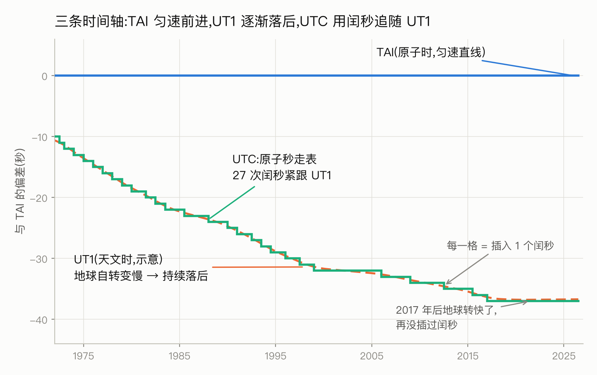
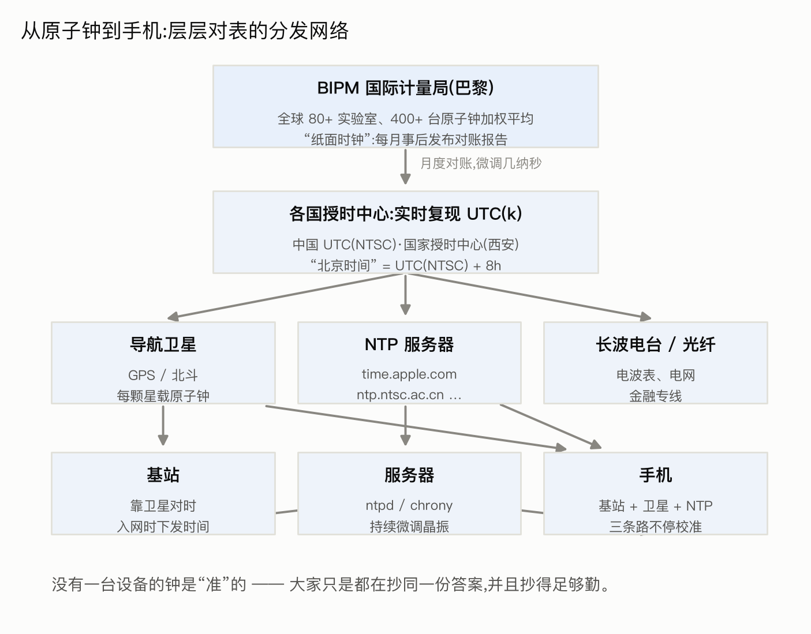
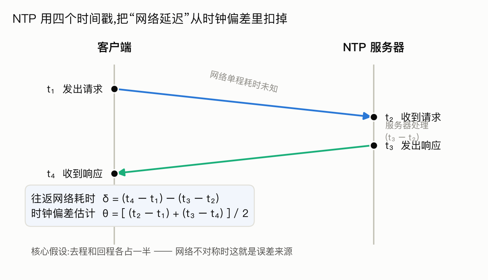
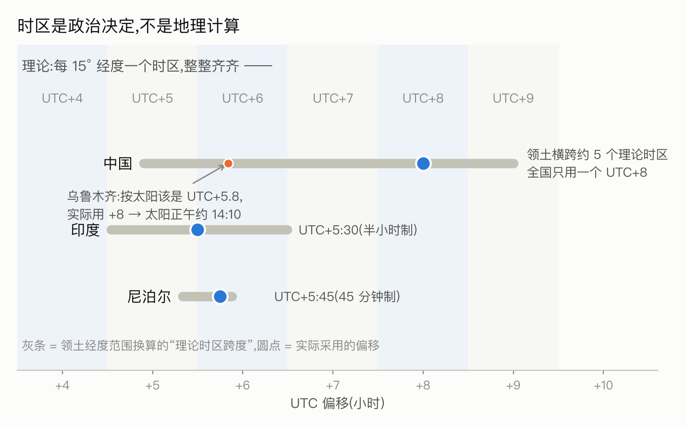
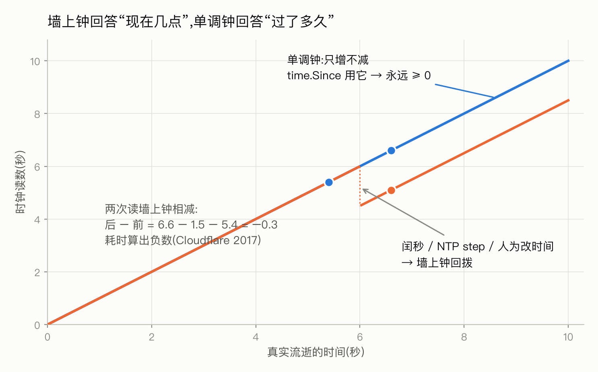

## Summary

时间大概是我们最熟悉又最陌生的东西。每个人手腕上、手机里、墙上都有钟，但很少有人能答上来这些问题:一秒到底是怎么定义的?为什么全世界几十亿部手机显示的时间几乎分毫不差——背后是谁在给它们对表?"公元 2026 年"里的"公元"是从哪算起的?为什么会有闰秒这种东西，它又怎么在 2012 年宕掉了半个互联网?

这一篇从头讲起:人类怎么一步步定义时间、全球的钟是怎么对齐的、时区和历法藏着哪些历史包袱、计算机里的时间又有什么特别的讲究。讲完你会发现，时间领域几乎所有的混乱，都来自同一个根源:**"时间"这个词其实混着好几个不同的东西——物理的流逝、人类的约定、机器的读数——而人们总把它们当成一个。**

---

## 一秒是多长:从地球到原子

### 天文时代:时间就是地球的自转

以前的人们的时间基准只有一个——**太阳**。太阳两次经过头顶最高点的间隔叫一天，切成 24 份是小时，再切 60 份、60 份，得到分和秒。所以最初的定义是:

> 1 秒 = 一天的 1/86400

随着时代发展，到了19世纪， 航海和铁路需要统一基准，各国约定用**当经过伦敦格林尼治天文台**的那条经线上的平太阳时作标准，这就是 **GMT(格林尼治标准时间)**。

这个定义有个隐藏假设:**地球自转是匀速的**。20 世纪原子钟出现后，人们用更准的尺子回头一量，发现假设不成立——地球自转在长期变慢。

### 原子时代:1967 年，秒被重新定义

研究发现原子的能级跃迁频率极其稳定，不受天气、地震、政治的影响。故在 1967 年国际计量大会把秒重新定义为:

> 1 秒 = 铯-133 原子基态两个超精细能级之间跃迁辐射 **9,192,631,770 个周期**的时长

这个数字不是凑整来的，而是精心测定的——让新秒的长度尽量等于旧的天文秒，平滑过渡。从此，时间的定义权从天文台交给了物理实验室。全世界几百台原子钟加权平均，得到 **TAI(国际原子时)**:一条绝对匀速、永不回头的时间轴。现代原子钟的误差大概是"几千万年差一秒"的量级。

### UTC:一场折中

UTC 是目前全世界民用时间的唯一基准，随着TAI的发现，当时世界上出现了两条时间轴:

```
TAI(原子时):绝对匀速，科学家喜欢，但和太阳的位置慢慢脱节
GMT(天文时):跟着太阳走，符合人类直觉，但忽快忽慢
```

脱节意味着什么?按 TAI 走上几千年，时钟显示中午 12 点时，太阳可能才刚升起。人类不能接受"12 点不是中午"，科学家不能接受"秒的长度不恒定"。于是在 1972 年起实行的折中方案就是 **UTC(协调世界时)**:

> **UTC 用原子秒走表，但当它和天文时间的偏差快超过 0.9 秒时，人为插入一个闰秒，把两者拉回来。**



上图就是这三条时间轴半个世纪的关系:蓝色的 TAI 笔直向前;橙色的天文时(UT1)因为地球变慢而持续落后;绿色的 UTC 用原子秒走表，每隔一段时间"咯噔"退一格——那就是闰秒，52 年里插了 27 次。

---

## 全世界的手机，为什么显示同一个时间

这是个值得停下来惊叹的事实:地球上几十亿部手机、无数台服务器，时间几乎分毫不差。没有哪家公司有能力给每台设备装原子钟——那它们是怎么对齐的?

答案是一张精心设计的**层层对表网络**。你的手机时间准，不是因为手机的钟好，而是因为它挂在这张网络的末梢上。



### 顶层:一个"纸面上的钟"

金字塔尖是 **BIPM(国际计量局，巴黎)**。全球 80 多个实验室的 400 多台原子钟持续上报数据，BIPM 加权平均出 TAI 和 UTC。有意思的是，**这个"世界标准时间"是每月事后发布的**——它是一份对账报告(Circular T)，告诉各实验室"上个月你的钟比世界平均快了多少纳秒"，而不是一个能实时看的钟。

真正实时走着的，是各国授时中心自己维护的 UTC 复现版本，记作 UTC(k)。中国的是 **UTC(NTSC)**，由中国科学院国家授时中心维护——它在陕西西安，不在北京。**"北京时间"其实产自西安**，定义就是 UTC(NTSC) + 8 小时。各国的复现钟平时和国际平均值只差几纳秒，月底拿到对账报告再微调。

### 中层:卫星是天上的钟塔

标准时间怎么发出去?功劳最大的是**导航卫星**。GPS、北斗的每颗卫星上都装着原子钟，导航电文里带着精确时间。很多人不知道:**卫星定位的本质就是靠时间**——接收机测四颗卫星信号的到达时间差，反推自己的位置，顺带就把自己的钟对到了百纳秒级。所以每个 GPS/北斗接收器同时也是一台高精度时钟，基站、电网、交易所都靠它对时。

地面上还有两条辅路:授时电台的长波信号(覆盖广、精度低，电波表用的就是它)，以及针对高精度场景的光纤专线。

### 末梢:手机其实在不停"抄答案"

手机里只有一颗普通石英晶振，误差约百万分之二十——听着小，**放着不管一天能漂 1.7 秒，一个月就漂出一分钟**。它从三条路不停校准自己:

- **基站**:入网时运营商直接下发时间(基站自己靠 GPS/北斗对时——移动网络对基站间同步的要求是微秒级，时间准是副产品)
- **卫星**:开着定位时，顺手就把钟对到了纳秒级
- **互联网 NTP**:联网后向时间服务器(苹果的 time.apple.com、国家授时中心的 ntp.ntsc.ac.cn)对表

所以那个惊叹的答案是:**没有一台设备的钟是"准"的，大家只是都在抄同一份答案，并且抄得足够勤。** 每一层都在不停校准上一层，漂移刚冒头就被摁回去。

### NTP:怎么隔着网络对表

网络对时有个绕不开的难题:服务器告诉你"现在 12:00:00.000"，可这句话在网线上走了多久?你不知道。NTP 用四个时间戳解这道题:



客户端记下发出请求的时刻 t₁，服务器记下收到的时刻 t₂ 和回复的时刻 t₃，客户端再记下收到回复的时刻 t₄。往返总耗时减去服务器处理时间，就是纯网络耗时;再**假设去程和回程各占一半**，就能解出两边时钟的偏差。

这个"来回各半"的假设在网络不对称时会引入误差，所以公网 NTP 的精度是毫秒级。也就是说，**两台联网机器之间存在几毫秒的时间差是常态**——这个事实后面讲分布式系统时会变得非常重要。

发现偏差后怎么修也有讲究:差得少就悄悄调整走表速度，让时间连续地追上去;差得多(超过 128 毫秒)就直接跳变。后者意味着**系统时间可能瞬间前跳甚至后退**——记住这一点，后面有大戏。

---

## 时区:政治远多于地理

### 理想模型与现实

地球 360 度经度，一天 24 小时，理论上每 15 度一个时区，整整齐齐。现实的时区地图却歪歪扭扭——因为**时区划分是政治决定，不是地理计算**:



- 中国领土横跨约 60 度经度(理论上 5 个时区)，但全国统一用 UTC+8。代价由西部承担:乌鲁木齐的太阳最高点出现在下午两点多，所以新疆的作息普遍比内地晚两小时。
- 印度全国用 UTC+5:30，尼泊尔用 UTC+5:45——偏移不一定是整小时。
- 朝鲜 2015 年把时区改成 UTC+8:30，2018 年又改回 UTC+9。

最后一条揭示了一个要点:**时区规则是会变的**。它不是数学常量，是各国政府随时可能修改的法律条文。所以世界上有一个专门的数据库(IANA 时区数据库)在持续追踪全球每个地区**从 19 世纪至今的全部规则变更史**，用"洲/城市"命名(`Asia/Shanghai`、`America/New_York`)，一年更新好几版，所有操作系统和编程语言都依赖它。

---

## 历法与纪年:年、月、公元

时间轴上不仅"秒"有故事，"年"和"公元"也全是补丁。

### 格里高利历和消失的十天

地球绕太阳一圈约是 **365.2422 天**——不是整数，这就是一切麻烦的来源。公元前 46 年，凯撒推行儒略历:"四年一闰，平均 365.25 天"。看着很接近，但每年多算约 11 分钟，攒 128 年就偏一天。到 16 世纪，累计偏差已达 10 天，春分从 3 月 21 日漂到了 3 月 11 日，教会推算复活节都对不上了。

1582 年教皇格里高利十三世推行新历法，干了两件事:

**第一，把多算的 10 天直接删掉**——1582 年 10 月 4 日(周四)的第二天是 10 月 15 日(周五)。中间那十天在历史上**不存在**。

**第二，修正闰年规则**，这就是沿用至今的版本:

```
能被 4 整除     → 闰年
但能被 100 整除 → 不闰        (1900 不是闰年)
但能被 400 整除 → 还是闰      (2000 是闰年)

平均年长 = 365 + 1/4 − 1/100 + 1/400 = 365.2425 天 ≈ 365.2422 ✓
```

各国切换到新历的时间还不一样:天主教国家 1582 年就改了，英国拖到 1752 年(删了 11 天，民间传说还引发过"还我 11 天"的抗议)，俄国拖到 1918 年(删了 13 天——所以"十月革命"按新历其实发生在 11 月)。处理历史日期时，"1700 年 1 月 1 日"在不同国家指的不是同一天。

### 公元是从哪算起的

"公元 2026 年"的"公元"，全称**公历纪元**，起点是耶稣诞生的那一年。

这套纪年法是公元 525 年一位叫**狄奥尼修斯(Dionysius Exiguus)**的修士发明的。他当时的任务是编制复活节日期表，顺手做了个决定:不再用当时通行的"罗马皇帝纪年"(那位皇帝以迫害基督徒著称，修士不想用)，改成从耶稣诞生年起算。他推算出的"主降生之年"就成了公元 1 年。后来这套纪年被 8 世纪的历史学家比德采用并推广，逐渐成为欧洲通行标准，再随着西方影响力变成全球标准。

中国采用公元纪年是 1949 年 9 月的决定。在此之前，传统纪年是**帝王年号 + 干支**:"康熙三十年""甲午年"——每换一个皇帝(甚至同一皇帝换个年号)就重新数，干支六十年一循环。读史料时把年号换算成公元年份，是史学的基本功之一。

---

## Unix 时间戳:计算机的时间原点

计算机不想管时区、历法、公元这堆账，它用最简单的模型:**挑一个原点，数秒数**。

> Unix 时间戳 = 从 **1970 年 1 月 1 日 0 点(UTC)** 起经过的秒数

1970 没有任何深意，就是 Unix 系统诞生时工程师顺手选的。这个模型有三个必须搞清的性质:

**① 时间戳没有时区。** `1757160000` 这个数在东京、纽约、上海是**同一个数**，它标识的是宇宙中同一个瞬间。时区只在把时间戳**翻译成人类可读文字**的那一刻才登场:

```
时间戳 1757160000 ──(按上海规则翻译)──→ "2025-09-06 20:00:00"
                  ──(按纽约规则翻译)──→ "2025-09-06 08:00:00"
        同一个瞬间，两种人类表述
```

"带时区的时间戳"是个伪概念——这是关于时间最常见的概念混乱，没有之一。

**② Unix 时间假装闰秒不存在。** 它规定每天恒等于 86400 秒。真实世界插入闰秒时，Unix 时钟的处理是把同一个秒数走两遍。这让"时间戳差值 = 真实流逝时长"在闰秒附近不严格成立——绝大多数场合无所谓，但这正是下一节事故的温床。

**③ 2038 年问题。** 用有符号 32 位整数存秒数，最大到 **2038 年 1 月 19 日 03:14:07 UTC**，再走一秒就溢出翻负，时间回到 1901 年。主流系统早已换 64 位(够用 2900 亿年)，但嵌入式设备、旧数据库字段、老协议里的 32 位时间，会在 2038 年集中爆雷——千年虫的续集已经排期。

实践中还有个精度陷阱:时间戳有秒(10 位数)、毫秒(13 位)、微秒、纳秒(19 位)几种口径。接口对接时只说"时间戳"不说精度，就是事故预定——13 位毫秒被当成秒解析，会得到公元 57000 年，这种 bug 每天都在世界某处发生。

---

## 闰秒:一秒钟宕掉半个互联网

回到 UTC 那个"人为插一秒"的补丁，看看它在计算机世界闯的祸。

闰秒插入时，UTC 时间轴上会出现一个正常世界不存在的时刻:

```
23:59:58
23:59:59
23:59:60      ← 多出来的这一秒，是合法的 UTC 时刻!
00:00:00
```

问题是几乎没有软件为 `23:59:60` 做过准备。操作系统的常见处理是让 `23:59:59` 重复一次——于是**系统时间倒退了一秒**。

**2012 年 6 月 30 日**的闰秒，Linux 内核一个定时器相关的 bug 被触发，大量服务 CPU 飙满，Reddit、Mozilla、LinkedIn 集体故障。**2017 年 1 月 1 日**的闰秒，Cloudflare 的 DNS 系统出错——代码用两次取当前时间的差值计算速率，默认"时间差不可能为负"，闰秒回拨让差值变成负数，后续计算直接崩溃。

大厂的工程化对策是**闰秒涂抹(leap smearing)**:与其突兀地插一秒，不如把这一秒摊到前后 24 小时里，每一秒都走得比标准秒慢一点点，均匀消化掉。Google、AWS 的时间服务都这么做。

这场几十年的折腾终于要收尾了:2022 年国际计量大会决议，**2035 年前废除闰秒**。此后 UTC 将与太阳时缓慢脱节——按目前的速率，攒出一分钟偏差要上百年，留给几百年后的人类去操心。工程史上，这是少有的"问题被官方宣布过期"的美好结局。

---

## 计算机里的两种时钟

闰秒事故揭示的那个事实值得单独一节，因为它是时间类 bug 的最大来源。操作系统其实同时维护着两种钟:

**墙上时钟(wall clock)**:回答"**现在几点了**"。对应真实世界的 UTC，会被 NTP 校正、被闰秒回拨、被人修改。适合打时间戳、记日志、显示给人看。

**单调时钟(monotonic clock)**:回答"**过了多久**"。通常是开机以来的滴答数，和真实世界的"几点"毫无关系，但**保证永远向前、绝不回跳**。适合测耗时、算超时。



上图就是 Cloudflare 那次事故的几何解释:橙色的墙上钟在中途被回拨，如果用它的两次读数相减算耗时，得到负数;蓝色的单调钟永远向前，差值永远非负。判据一句话:**关心"何时"用墙上钟，关心"多久"用单调钟。**

Go 语言在 1.9 版本(正是被闰秒事故推动的)做了个漂亮设计:`time.Now()` 返回的值**同时携带两种读数**，`time.Since(start)` 自动用单调读数相减——程序员写最自然的代码就自动免疫时钟回拨。但单调读数出不了进程:它是"开机以来的滴答"，别的机器、甚至本机重启后都无从对齐。所以**跨机器的时间只能靠墙上时钟，而墙上时钟不可全信**——这正是下一节的起点。

```go
type Time struct {
      wall uint64  // 墙上钟读数:年月日时分秒(给"现在几点"用)
      ext  int64   // 单调钟读数:开机以来的纳秒数(给"过了多久"用)
      loc  *Location
}
```

---

## 分布式系统:不要用时钟判断先后

前面说过，NTP 对时后两台机器之间仍有几毫秒级的真实偏差。这产生一个残酷结论:

> **两台机器的时间戳之差小于时钟偏差时，你无法断定谁先谁后。**

机器 A 在 `12:00:00.020` 写入了数据，机器 B 在 `12:00:00.015` 写入了同一条数据。B 的时间戳更早——但如果两台机器的时钟偏差有 10 毫秒，**真实顺序完全可能相反**。用"时间戳大的获胜"来解决冲突的系统，会**静默丢数据**:时钟慢的那台机器上的新写入，被时钟快的机器上的旧写入覆盖，没有任何报错。

工程上的应对分三层，思路一个比一个深:

**① 能不比就不比。** 需要"谁先谁后"时，让一个单点(主库、共识组)来定序，或者用单调递增的版本号、任期号，都比各自打时间戳可靠。

**② 不用物理时间，改记因果。** Lamport 逻辑时钟的思想:每个节点带个计数器，发消息捎上，收消息取最大值再加一。它不告诉你"几点"，但保证**如果事件 A 影响了事件 B，那么 A 的编号一定小于 B**——分布式系统要的往往只是这个。

**③ 承认误差，把它变成可计算的量。** Google Spanner 的 TrueTime 不返回"现在是几点"，而是返回"现在在某个区间内，保证真值在里面"(靠每个机房的原子钟 + GPS 把区间压到几毫秒)。要确定两个事件的先后，就等到区间不重叠再提交。与其假装时钟精确，不如把不确定性摆上台面。

区块链面对的更极端:出块的人**有动机在时间戳上撒谎**(能影响挖矿难度、清算价格)。比特币的规则很有代表性:块时间戳必须大于**前 11 个块时间戳的中位数**、且不超过本地时间 2 小时——中位数不怕单点撒谎，±2 小时的宽容度则是承认"全球节点的钟本来就不齐"。所以合约代码里的块时间只能当"小时级"的粗略参考，拿它做精确判断或者随机数，是安全审计里的经典扣分项。

---

## 写代码的人，最后记这几条

把全文收成一张短清单:

- **存 UTC，显示的那一刻才转时区**;交换格式用 `2026-09-06T12:00:00Z` 这种无歧义写法
- 说"时间戳"必须带精度(秒还是毫秒);新系统一律用 64 位
- 时区用 IANA 名字(`Asia/Shanghai`)，**永远不要硬编码 UTC+8**——固定偏移表达不了夏令时，也扛不住政府改规则
- "未来的本地时间"(比如明年的会议)要存**本地时间 + 时区名**，不能先换算成 UTC 存——换算发生在规则可能变更之前，就锁死了旧规则
- 测耗时用单调钟;永远不要假设系统时间单调递增，也不要假设两台机器时间相等
- 定时任务避开凌晨 1–3 点(夏令时变更时段)，或干脆用 UTC 调度

---

## 小结

回到开头那句话:"时间"混着三个东西——**物理的流逝**(原子钟、单调钟管这个)、**人类的约定**(UTC、时区、历法、公元管这个)、**机器的读数**(晶振加对表，是前两者的不完美副本)。

全世界手机时间一致，靠的不是每台设备有好钟，而是一张从巴黎的"纸面时钟"到卫星、到基站、到你口袋里的层层对表网络;公元纪年的原点是一位 6 世纪修士的推算(而且大概率算错了四五年);闰秒是原子时和天文时之间打了五十年的补丁，即将退役;而计算机世界几乎所有的时间 bug，都是拿错了钟——拿人类约定去测物理流逝，或者拿机器读数去断事件因果。

**分清你要的是"何时"、"多久"还是"先后"，然后选对应的那个钟**
