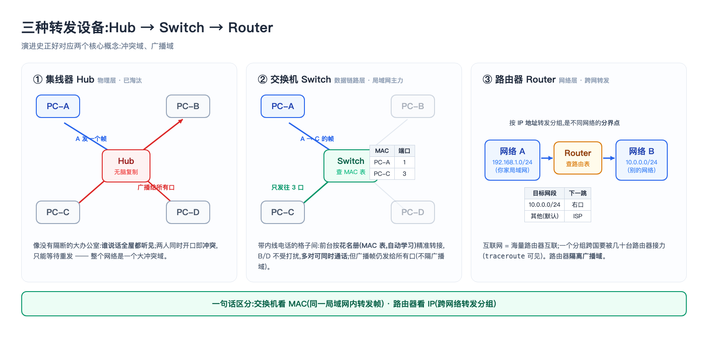
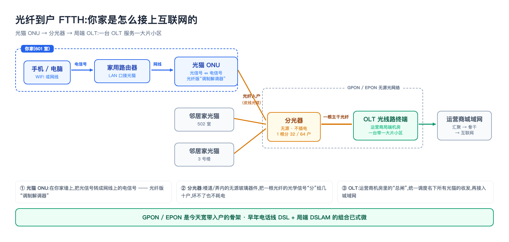
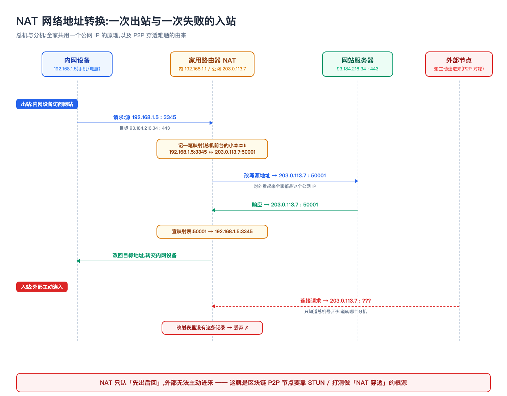
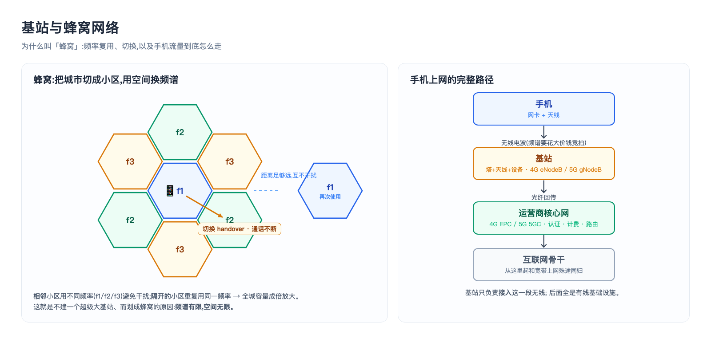
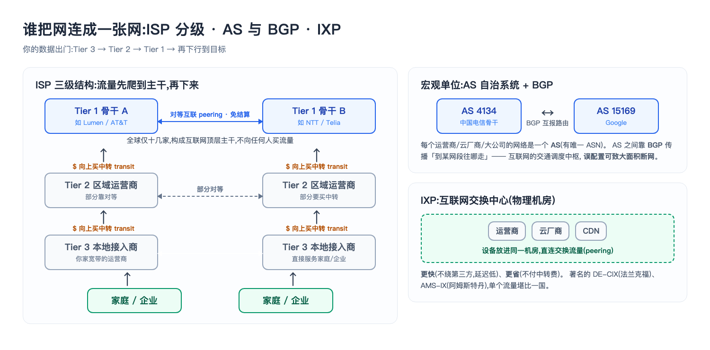
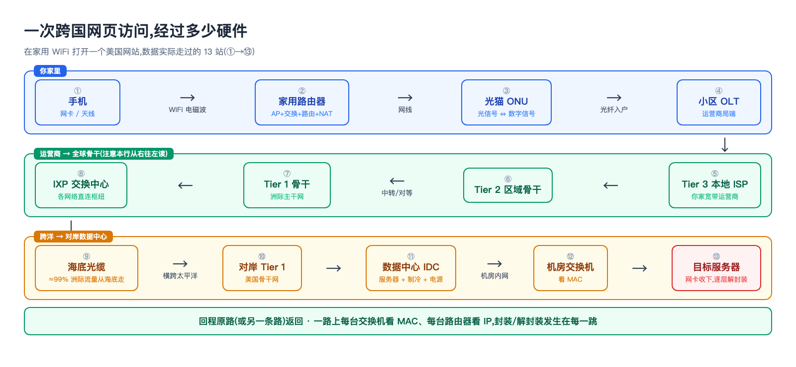

## Summary

说到网络，大家第一个想到的都是TCP、IP协议这些的，很容易忽略网络的硬件设施，我们这一篇主要讲网络的硬件基础设施。

## 一个前提:互联网是"分组交换"的

在讲设备之前,先建立一个总观念。这两种方式的差别,用**包车 vs 拼车**一比就清楚了。

早期电话网用**电路交换**,相当于**包车**:通话前先在你和对方之间**独占一条物理线路**,从头包到尾。好处是稳定、有保障;坏处是你俩沉默不说话的时候,这条线也空着,谁都不能用。

互联网用的是**分组交换(packet switching)**,相当于**拼车 + 分批发货**:数据被切成一个个小**分组(packet)**,每个分组自己写好目标地址,**各自独立地在网络里被一台台设备接力转发**,和别人的分组混着走同一批线路。

这么做有两个好处。一是**利用率高**，整条线路不会因为某个人不说话就闲着(术语叫统计复用);二是**抗故障**，包车时路断了就彻底完蛋,拼车时这条路堵了,后面的分组自己换条路走,照样能到。

代价是不再有"独占"的保障:大家挤在一起,可能排队、可能延迟、拥堵时甚至可能被丢弃。**互联网从设计之初就选择了"高利用率 + 不保证",这个取舍是理解后面 TCP 为什么那么费劲的总源头。**

**物理层面上的所有的交换机、路由器,本质工作都是同一件事:收到一个分组/帧,看它的地址,决定从哪个口把它转发出去。** 区别只在于"看的是哪一层的地址"。记住这条主线,后面就不会乱。

---

## 网卡与传输介质

### 网卡(NIC,网络接口卡)

每台能上网的设备(电脑、手机、服务器、路由器)里都有**网卡**。它是设备接入网络的物理出入口,负责把内存里的数据变成能在介质上传输的信号,反之亦然。

**关键:每块网卡出厂时烧录了一个全球唯一的 MAC 地址**(48 位,如 `a4:83:e7:1b:2c:9f`)——这个就是数据链路层用来标识设备的物理地址。IP 地址是"逻辑的、会变的"(换网络就变),MAC 是"物理的、跟着网卡走的"。

### 传输介质:数据到底在什么上面跑

信号需要物理载体,常见三类:

- **双绞线(网线)**:最常见的入户/机房铜缆,两根铜线拧成对以抵消干扰。按等级分 Cat5e/Cat6/Cat6a……等级越高支持的速率和距离越好。你家路由器到电脑那根就是它,接口叫 RJ45。
- **光纤(光缆)**:用**光信号**在玻璃纤维里传输,速率高、损耗小、传得远、抗电磁干扰,是骨干网(运营商连接城市与城市、国家与国家的大动脉线路,相当于公路系统里的省际高速)和现代入户(光纤到户)的主力。分**单模**(细芯,激光,长距离,城际/海底)和**多模**(粗芯,LED,短距离,机房内)。
- **无线(电磁波)**:WiFi、蓝牙、蜂窝(手机信号)都是无线,不需要线,用天线收发电磁波。介质是"空气",代价是易受干扰、共享带宽。
- (还有**同轴电缆**,早期以太网和有线电视宽带用,现在家用场景基本被光纤取代。)

---

## 局域网内部:集线器 → 交换机 → 无线 AP

### 集线器 Hub(物理层,已淘汰)

最原始的连接设备,工作在**物理层**。它没有一点"智能"——**从一个口收到信号,就无脑复制、广播到其他所有口**。

这就像一间没有隔断的大办公室:任何人说话,全屋都听得见。想跟某个同事说句话?你得喊出来,所有人都被迫听着,然后靠"这不是叫我"来自行过滤。

问题很明显:**同一时刻只能有一个人说话**,两个人一起开口就是一片嘈杂,谁的话都听不清(术语叫**冲突/碰撞**),只能都闭嘴、等一会儿再重说。整间办公室构成一个巨大的**冲突域**,人一多就彻底没法交流了。所以集线器早已被交换机淘汰,了解即可。

### 交换机 Switch(数据链路层,局域网主力)

交换机工作在**数据链路层**,比集线器聪明得多:它内部维护一张 **MAC 地址表**(哪个口连着哪个 MAC 地址),收到一个数据帧时,**只转发到目标 MAC 所在的那个口**,而不是广播给所有人。

接着上面的比方:交换机把大办公室换成了**带内线电话的格子间**。前台(交换机)有一本花名册,知道谁坐哪个工位,你要找谁它就把线接到谁那儿去——**别人完全不受打扰,而且好几对人可以同时通话**。

这带来质变:

- **每个端口是独立的冲突域**,多对设备可以同时通信互不干扰,速率大幅提升,还支持全双工(收发同时进行)。
- 它靠"**学习**"自动建 MAC 表:看到某个口进来的帧的源 MAC,就记下"这个 MAC 在这个口"。遇到不认识的目标 MAC 才广播一次问一下。

交换机是今天局域网/机房里最核心的连接设备。**但注意:交换机不隔离广播——一个设备发广播帧,交换机会转给所有口。** 这些交换机连起来的范围构成一个**广播域**;要隔离广播、划分子网,得靠路由器或 VLAN。

### 无线接入点 AP(Wireless Access Point)

无线 AP 是"无线世界的交换机":它让 WiFi 设备通过电磁波接入有线局域网,本质是有线网和无线设备之间的桥梁。企业里常见独立 AP;家里则通常和路由器集成在一个盒子里(见下节)。



---

## 家庭如何接入互联网:调制解调器、光猫、家用路由器

局域网建好了,怎么连到外面的互联网?这就要靠运营商(ISP)的接入设备。

### 调制解调器 Modem(调制/解调)

计算机产生的是数字信号,但接入线路(电话线、有线电视同轴、光纤)传的往往是另一种形式的信号。**调制解调器(Modem)** 负责在两者间转换:发送时把数字信号"调制"成线路信号,接收时"解调"回来——名字就是 Modulate + Demodulate。

### 光猫 ONU 与局端 OLT(光纤入户 FTTH)

现在主流是**光纤到户(FTTH)**。你家墙上那个把光纤转成网线的盒子,就是**光猫(ONU,光网络单元)**——它是光纤线路上的"调制解调器"。

而在运营商机房那一端,有一台 **OLT(光线路终端)**,一台 OLT 通过分光器连接**一大片小区**的很多光猫。这套 GPON/EPON 技术,是今天宽带入户的骨架。(早年用电话线上网则是 DSL + DSLAM,现已式微。)



### 家用路由器:一个盒子里其实塞了好几种设备

你家那台"路由器",其实是**多种设备的集成体**,理解这点能瞬间打通很多概念。它通常同时是:

- **路由器**:连接你的家庭网络和 ISP,做跨网转发。
- **交换机**:背后那几个 LAN 网口,就是个小交换机。
- **无线 AP**:发 WiFi 信号。
- **NAT 网关**:见下。
- **DHCP 服务器**:自动给家里每个设备分配内网 IP(`192.168.x.x`)。
- **防火墙**:基础的安全过滤。

**其中 NAT(网络地址转换)特别值得懂**,因为它顺带解释了区块链 P2P 里那个著名的难题。

背景是 IPv4 地址不够用了(总共才 43 亿个),运营商通常只给你家**一个**公网 IP。可你家有十几个设备要上网,一个 IP 怎么够分?

答案是**公司总机的办法**:整个公司对外只有一个总机号码,内部每人一个分机。员工打外线时,前台把号码换成总机号发出去,并记一笔"这通电话是 305 分机打的";外面回电到总机时,前台一查记录,转接给 305。

路由器做的 **NAT** 就是这件事:出去时把"内网 IP + 端口"换成"公网 IP + 另一个端口",并记下这条映射;回来时按映射换回去。这就是为什么你家所有设备对外"看起来是同一个 IP"。

**注意这个机制有个方向性的副作用:外面的人没法主动拨进来。** 他只知道总机号,不知道该转哪个分机——前台的记录本里根本没有这一条。这正是**区块链 P2P 节点"NAT 穿透"难题的根源**:两个都躲在各自路由器后面的节点,谁也没法主动连上谁。(NAT 也是**区块链 P2P 节点**要处理 "NAT 穿透" 的根源——两个都躲在各自路由器后面的节点,怎么直接连上对方,是个真实难题。)



---

## 移动网络:基站与蜂窝网络

**基站**,是**移动/蜂窝网络**的核心接入设施——手机不插网线,靠它上网。

- **基站(Base Station)**:一根塔 + 天线 + 设备,在城市和山上很常见，负责和覆盖范围内的手机用**无线电波**通信。4G 里叫 **eNodeB**,5G 里叫 **gNodeB**。
- **蜂窝(cellular)**:整个地理区域被划分成一个个像蜂窝一样的**小区(cell)**,每个小区由一个基站覆盖。

    为什么要划成小格子,而不是建一个超级大功率的基站覆盖整座城?因为**无线频谱是有限的**——同一个频率同一时间只能供有限的人用。划成小区之后,隔开一定距离的两个小区就可以**重复使用同一个频率**而互不干扰,整座城的容量因此成倍放大。这就是蜂窝网络最核心的设计智慧:**用空间换频谱**。

    相邻小区用不同频率避免干扰;你移动时,通信会从一个基站"**切换(handover)**"到另一个,通话/上网不中断。
- **频谱**:无线通信占用特定频段(如 700MHz、2.6GHz、5G 毫米波),频谱是稀缺资源,运营商要花大价钱竞拍。
- **核心网(Core Network)**:基站只是接入。手机数据经基站汇聚后,还要进入运营商的**核心网**(4G 的 EPC、5G 的 5GC)做认证、计费、路由,最终接入互联网骨干。

所以手机上网的路径大致是:**手机 →(无线电波)→ 基站 → 运营商核心网 → 互联网骨干**。



---

## 从局域到全球:路由器与广域网

交换机管的是"同一个局域网内部"。要跨越不同网络(你家网络 → 运营商 → 目标服务器所在的网络),靠的是**路由器**。

**路由器工作在网络层(第三层)**,按 **IP 地址** 转发**分组**。它维护**路由表**,收到一个分组就查表:"目标 IP 属于哪个网段,下一跳该发给哪个路由器?" 然后转发出去。互联网就是由**海量路由器互相连接**构成的,一个分组从北京到纽约,要经过几十台路由器接力(你用 `traceroute`/`tracert` 能亲眼看到这条路径上的每一跳)。

**交换机 vs 路由器,一句话区分:**

- **交换机**:同一个局域网内部转发,看 **MAC** 地址,数据单元是**帧**,不隔离广播。
- **路由器**:连接不同网络转发,看 **IP** 地址,数据单元是**分组**,隔离广播、是网络的分界点。

(现实中还有"三层交换机",融合了两者能力,机房里常见。)

---

## 谁把这些网络连成一张网:ISP、自治系统、IXP

一个个局域网、一台台路由器,怎么就成了"全球一张网"?靠的是运营商之间的层层互联。



### ISP 的分级

**ISP(互联网服务提供商)** 分三层:

- **Tier 1(一级运营商)**:拥有横跨大洲的骨干网,彼此之间**免费对等互联**(settlement-free peering),不用向任何人买流量。全球就那么十几家(如 Lumen、AT&T、NTT、Telia)。它们构成互联网的"顶层主干"。
- **Tier 2(二级)**:区域性运营商,一部分靠和别人对等,一部分要向 Tier 1**购买中转(transit)**才能到达全球。
- **Tier 3(三级)**:本地接入商,直接服务家庭和企业(就是你家宽带的运营商),主要靠向上级买流量。

你的数据出门,通常是 **Tier 3 → Tier 2 → Tier 1 → 再往下到目标**,像爬到主干再下来。

### 自治系统 AS 与 BGP

互联网在宏观上不是按"一台台路由器"组织的,而是按 **自治系统(AS,Autonomous System)**——每个 AS 是一个由单一机构管理的网络(一家运营商、一个大公司、一个云厂商),有唯一的 **ASN 编号**。

AS 与 AS 之间怎么找路?靠 **BGP(边界网关协议)**——互联网的"路由总协议",负责在数万个 AS 之间传播"想到达某个网段该往哪走"的信息。BGP 出问题会引发大面积断网(历史上多次大事故都是 BGP 误配置导致的),它是互联网真正的"交通调度中枢"。

### IXP:互联网交换中心

**IXP(Internet Exchange Point)** 是一个**物理机房**,让许多不同的网络(运营商、云厂商、CDN)把设备放进来、**直接互联交换流量(peering)**,而不必绕远路经过第三方。

好处是**更快(延迟低)、更省(不用给中转商付费)**。著名的如法兰克福的 DE-CIX、阿姆斯特丹的 AMS-IX,一个大型 IXP 承载的流量堪比一个国家的互联网。你可以把 IXP 理解成"互联网的交通枢纽/立交桥"。

---

## 支撑全球的物理动脉

最后是那些"看不见但极其关键"的大型基础设施:

- **海底光缆(Submarine Cables)**:横跨大洋、铺在海底的光缆,**承载了约 99% 的洲际数据流量**。在中国访问美国的服务器,数据是真的从海底"游"过太平洋的——不是走卫星。全球有几百条,一条被渔船或地震弄断,就可能造成跨国网络拥堵。(可以去 submarinecablemap.com 看这张震撼的世界地图。)
- **数据中心 / 机房(IDC)**:成千上万台服务器 + 交换机 + 路由器 + 制冷 + 备用电源的大型建筑。你访问的网站、云服务、区块链节点,物理上就跑在某个数据中心的某台服务器里。
- **CDN 边缘节点**:内容分发网络把内容(图片、视频、网页)缓存在**离用户近的各地节点**,让你就近取,又快又减轻源站压力(后面 CDN 篇细讲)。
- **卫星互联网**:如 Starlink,用大量**近地轨道(LEO)卫星**为偏远地区、海洋、飞机提供接入,是地面基础设施的补充。

---

## 串起来:一次跨国网页访问,经过了多少硬件

把本篇所有设备连成一条链,看你在家用 WiFi 打开一个美国网站,数据实际经过:

```
你的手机(网卡/天线)
   └─(WiFi 电磁波)─▶ 家用路由器(AP+交换机+路由+NAT+DHCP)
        └─(光纤)─▶ 光猫 ONU ─▶ 小区 OLT ─▶ 本地 ISP(Tier 3)的路由器们
             └─▶ 区域 ISP(Tier 2)骨干路由器
                  └─▶ Tier 1 骨干 ─▶ IXP 互联网交换中心
                       └─(海底光缆,横跨太平洋)─▶ 对岸 Tier 1
                            └─▶ 目标网站所在的数据中心
                                 └─▶ 机房交换机 ─▶ 目标服务器网卡
```



回程原路(或另一条路)返回。**这一路上,每一台交换机看 MAC、每一台路由器看 IP、每一段介质承载信号——全是本篇讲的硬件在协作。** 

---

## 设备对应到分层模型(一张总表)

这张表把"硬件"和"分层"钉死,是本篇最该记住的总结:

| 设备 | 工作在哪一层 | 依据什么转发 | 数据单元 | 是否隔离广播 |
|------|------------|------------|---------|------------|
| 网线 / 光纤 / 天线 | 物理层 | —(只传信号) | 比特 bit | — |
| 集线器 Hub | 物理层 | 无脑广播 | 比特 bit | 否(单一冲突域) |
| 交换机 Switch | 数据链路层 | MAC 地址 | 帧 frame | 否(隔离冲突,不隔广播) |
| 无线 AP | 数据链路层 | MAC 地址 | 帧 frame | 否 |
| 路由器 Router | 网络层 | IP 地址 | 分组 packet | **是**(网络分界) |
| 基站 | 物理/链路层(接入) | 无线资源调度 | 帧/无线块 | — |

---
