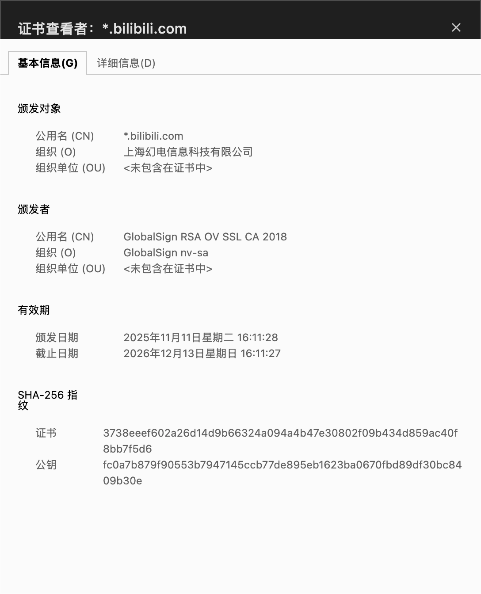
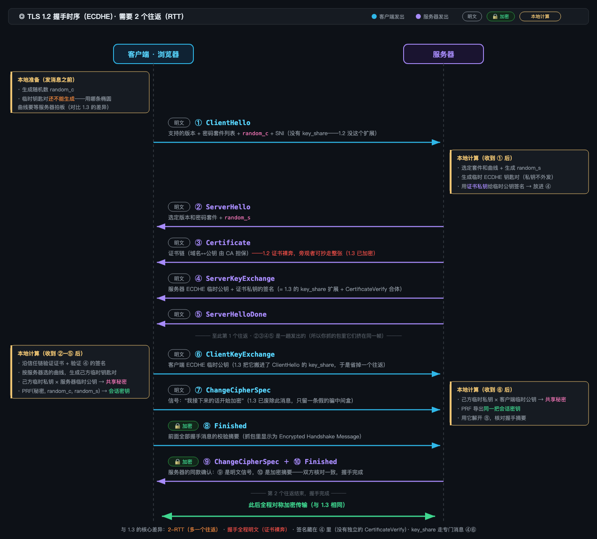
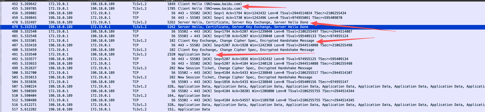
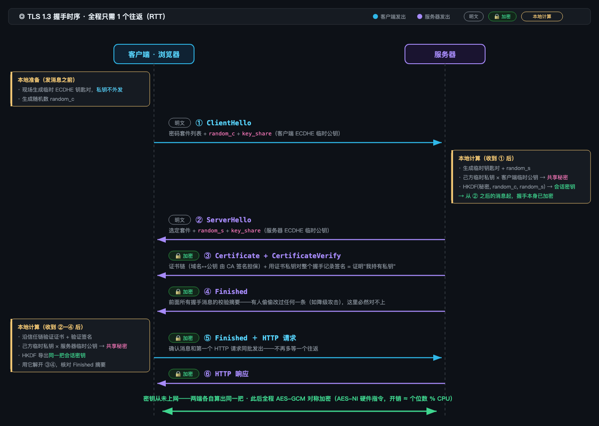
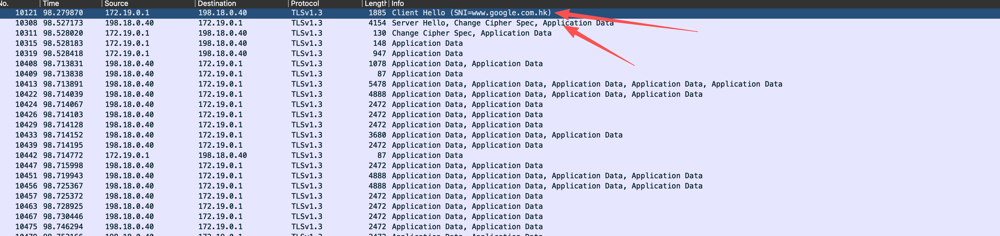

## Summary

最近在部署一个api的服务，想起来以前一位组长关于https做的分享相当不错，现在学习一下，希望还来得及。

故事呢，还要先从一个明信片开始讲起。

## 第一章：明信片

Alice 在国外旅行，想给 Bob 汇款，于是写信告诉 Bob 自己的银行卡号和密码。

问题是，她只有明信片可用。

明信片会经过邮递员、分拣站、Bob 家楼下的门房——每一双手都能翻过来读一遍。窃听者 Eve 就在分拣站工作，她甚至不需要"偷"，只需要"看"。

这就是 HTTP：**你以为在寄信，其实全程在寄明信片**。你在咖啡馆 WiFi 上输入的密码、浏览的页面，对整条链路上的任何设备都是敞开的。

更糟的还在后面。分拣站还有个叫 Mallory 的员工，他不满足于看——他把明信片上的收款账号涂掉，改成自己的。Bob 收到的还是"Alice 的来信"，钱却进了 Mallory 的口袋。

这时候 Alice 需要三样东西：**别人看不懂（防窃听）、别人改不了（防篡改）、确认对方真是 Bob（防冒充）**。整个故事就是凑齐这三样。

---

## 第二章：带锁的盒子

Alice 想了个办法：买一个带锁的铁盒，把信锁进去寄出。Eve 在分拣站拿到盒子，摇一摇，什么也看不到。

这就是**对称加密**（AES）：一把钥匙，锁和开都靠它。而且这种锁又快又结实——现代 CPU 有专门的硬件指令，加密一部电影只要一眨眼。

但 Alice 立刻发现自己犯了个傻：**Bob 没有钥匙，他收到盒子也打不开。**

怎么把钥匙给 Bob？

- 随信寄过去——Eve 连盒带钥匙一起收下，等于没锁
- 提前见面交给 Bob——可 Alice 和 Bob 素不相识，她昨天才第一次访问 Bob 的网站

这就是困扰了密码学几千年的**密钥分发问题**：锁再好，钥匙的运送本身就是最脆弱的一环。对称加密自己救不了自己。

---

## 第三章：Bob 的挂锁

Bob 想出一个漂亮的反转：**钥匙不动，锁动。**

Bob 打造了一种特殊的挂锁，配一把钥匙。他把打开的挂成箱地寄给所有想给他写信的人——分拣站随便拿，Eve 想要也送她一个。而**钥匙只有一把，从不离开 Bob 的口袋**。

Alice 收到挂锁，把信放进盒子，"咔哒"一声扣上。从这一刻起，全世界只有一个人能打开这个盒子——Bob。扣上挂锁不需要钥匙，打开才需要。Alice 自己都打不开自己刚锁上的盒子。

这就是**非对称加密**：挂锁是**公钥**（public key，公开发放，人人可取），口袋里的钥匙是**私钥**（private key，永不示人）。公钥加密的东西，只有私钥能解。

密钥分发问题解决了：**需要在不安全线路上传递的东西（挂锁），偷走也没用；有用的东西（钥匙），从不上路。**

只是这种魔法挂锁有个缺点：锁一次的工序比普通铁锁慢上百倍。所以 Alice 和 Bob 商定了一个聪明的用法——**用挂锁只寄一样东西：一把普通铁锁的钥匙**。之后的大量信件全用快的铁锁。魔法挂锁只在开头用一次。

这就是 HTTPS 的**混合加密**：非对称加密负责安全地送出对称密钥，之后全程对称加密。记住这个结构，最后一章会原样出现。

---

## 第四章：Mallory 的调包计

Eve 因为看不到信件所以被out了，但 Mallory 比她狡猾得多。他在分拣站干了一票大的。

Alice 写信给 Bob 说："把你的挂锁寄给我。" Mallory 截下了 Bob 寄回的挂锁，**换成了自己的挂锁**，继续寄给 Alice。

Mallory 的挂锁和 Bob 的看起来一模一样。Alice 毫无察觉，把银行卡密码锁进盒子寄出。Mallory 截下盒子，用**自己的**钥匙打开，抄下密码，再把信放进**Bob 的**挂锁里锁好，寄给 Bob。

Bob 收到信，正常打开，正常回信。**Alice 和 Bob 都觉得一切正常，而 Mallory 坐在中间读完了每一个字。**

这就是**中间人攻击（MITM）**。注意它可怕的地方：挂锁的工艺（加密算法）毫无破绽，破的是更早的一环——**Alice 从头到尾没有办法确认"手里这把挂锁真的是 Bob 的"**。挂锁上又没刻名字；就算刻了，Mallory 也会刻个一样的。

加密解决不了这个问题。因为这不是加密问题，是**公钥本身无法自证归属**的问题，这时就需要一个双方都信任的第三方来担保"这把公钥确实属于 Bob"。

---

## 第五章：Trent 的火漆印章

镇上有位德高望重的公证人 Trent，他的火漆印章全镇人都认得，而且**无法伪造**——只有 Trent 手里那枚印章能压出那个纹路（这就是**数字签名**：Trent 用自己的私钥签名，任何人都能用 Trent 的公钥验证，但没人能伪造）。

Bob 带着挂锁和身份文件去找 Trent。Trent 验明正身后，开出一张证明书：

> 兹证明：这把挂锁（此处附挂锁的完整描述）属于 Bob 本人。
> —— 公证人 Trent（火漆印章）

从此 Bob 寄挂锁时都附上这张**证书**。Alice 收到后先验火漆印：印章是真的 → 证明书没被改过 → 证明书说这把挂锁是 Bob 的 → 放心使用。

Mallory 再想调包就难了。他可以换挂锁，但证明书上描述的还是 Bob 的挂锁，对不上；他想改证明书，火漆印就碎了；他想伪造火漆印——做不到，印章在 Trent 手里。

Trent 就是 **CA（证书颁发机构）**，火漆印章就是 CA 的私钥签名，那张证明书就是 **HTTPS 证书**——它的本质自始至终只有一句话：**把"某把公钥"和"某个身份（域名）"绑在一起，由可信第三方担保**。

还剩最后一个递归问题：Alice 凭什么认得 Trent 的印章？答案朴素得出奇——**Alice 从小就见过**。她出生时家里长辈就教她认了镇上几位公证人的印。对应到现实：**操作系统和浏览器出厂时，就内置了一百多个根 CA 的公钥**。信任必须有一个不证自明的起点，这个起点是"预装"。

下面是某个网站的证书示例：



（顺带一提：如果有人骗 Alice"再认一枚新印章"，那么这个人从此能给任何假挂锁开证明——这就是"别乱装来路不明的根证书"的原因，也是抓包工具能解密 HTTPS 的全部秘密，Charles这个工具就是让你信任它自己的root证书，从而获取https的抓包功能）

---

## 第六章：烧掉的钥匙

故事本可以在这里结束，但 Bob 睡不着。

他想到一件后怕的事：Mallory 这些年**把所有截到的盒子都原样复制、存在地下室里**——虽然打不开。而全部信件共同的软肋，是 Bob 口袋里那一把私钥。哪天钥匙被偷、被抢、被法院强制交出，Mallory 地下室里**历年的信件会在同一天全部洞开**。

一把钥匙，陪葬所有历史。

所以 Bob 改了规矩。从此**每次通信都现场打一对新挂锁**：Alice 也现场打一对。两人隔空各自比划一番（迪菲-赫尔曼密钥交换的数学魔法：各自用自己的新私钥和对方的新公钥，能算出**同一个**秘密数字，而旁观的 Mallory 拿着两把公钥也算不出来），用这个只存在于两人脑中的数字当作本次的铁锁钥匙。**通信一结束，双方把临时钥匙扔进火炉。**

那 Bob 祖传的那把私钥干什么用？**只干一件事：在证明书体系里签名，证明"我是 Bob"。它再也不参与任何加密（数字签名）。**

于是就算多年后 Bob 的私钥失窃，Mallory 也只能拿它**冒充未来的 Bob**（很快会被吊销证书阻止），而地下室里的历史信件永远打不开——因为打开它们的钥匙**早已烧掉，且从未写在任何纸上**。

这叫**前向保密（Forward Secrecy）**：今天的泄露，不殃及昨天。TLS 1.3 已经强制要求这种做法——第三章里"用挂锁直接寄铁锁钥匙"的老办法（RSA 密钥交换），因为做不到这一点，被整个废除了。

---

## 第七章：三分钟的仪式

现在，把六章的道具全部摆上桌，看 Alice（浏览器）和 Bob（服务器）如何在三次传话内完成所有事——这就是 **TLS 1.3 握手**：

**Alice 喊话**（ClientHello）：
"Bob！我要和你说话。我会用这几种铁锁『密码套件』；这是我现场新打的临时挂锁『key_share』；另外我抛了个硬币，结果是 3182『random_c』。"

（她不等确认就把临时挂锁直接带上了——赌 Bob 认识这种锁。赌中，就省了一个来回。）

**Bob 回话**（ServerHello + 证书 + 签名 + Finished）：
"好，就用你说的第二种铁锁。这是**我**现场新打的临时挂锁和我的硬币结果 7549『random_s』。——到这里，Bob 已经能用双方的临时锁算出今天的铁锁钥匙了，所以**从下一句起他压低了声音（加密）**——这是 Trent 给我的证明书『证书链』；为了证明我不是拿着别人证明书的骗子，我用祖传私钥**给咱俩刚才说过的每一句话签了名**『CertificateVerify』；最后，这是刚才全部对话的摘要『Finished』，你核对一下，确认没人偷偷改过咱们的话。"

**Alice 回话**（Finished + 数据）：
"摘要核对无误。『Finished』——顺便，我的第一句正事也一起说了：请把我的账户页面给我。"

仪式结束。**没有任何一句话里出现过铁锁钥匙本身**——它是在两人各自的脑中"长"出来的。此后所有对话都锁在铁盒里，Eve 听到的是噪音，Mallory 改一个字校验就会碎，而且他连今天这场对话是和"真 Bob"进行的这件事都无法破坏。

## 第八章：真实握手

当前正在运行的tls版本有两个，1.2和1.3

1.2 握手过程如下：



抓包 https://www.baidu.com 的实际过程，如图所示，握手过程中的消息都是明文可以查看的。



1.3 握手过程如下：



抓包 https://www.google.com.hk 的实际过程，如图所示，Server Hello之后的消息都是加密的，和上图是一致的。



## 密码学积木 

### 2.1 对称加密：快，但密钥怎么送过去

加密和解密用**同一把钥匙**（如 AES-256）。

- 优点：极快（CPU 有硬件指令，加密 1GB 数据毫秒级）
- 死穴：**密钥分发**——钥匙本身怎么安全地告诉对方？明文发钥匙等于没加密

结论：HTTPS 传输数据全程用对称加密，但握手阶段必须先解决"怎么安全地商量出这把钥匙"。

### 2.2 非对称加密：解决密钥分发，但太慢

一对钥匙：**公钥加密的内容，只有私钥能解**（如 RSA、椭圆曲线）。公钥可以随便公开——贴在网站上都行，因为它只能加密不能解密。

- 优点：不需要事先共享秘密。你用我的公钥加密，全世界只有持有私钥的我能解
- 缺点：比对称加密**慢 100-1000 倍**，不可能用它加密所有流量

结论：**混合使用**——用非对称加密解决"密钥分发"（只在握手时用一次，保护那把对称密钥），之后全程对称加密。这是理解整个 TLS 的钥匙。

### 2.3 数字签名：非对称加密反着用

把非对称钥匙对反过来用：**私钥签名，公钥验证**。

```
服务器：对内容算哈希 → 用私钥加密这个哈希 → 得到"签名"，附在内容后
验证方：用公钥解开签名得到哈希 A → 自己对内容算哈希 B → A == B？
```

验证通过则同时证明两件事：内容出自私钥持有者之手（**身份**），且没被改过一个字（**完整性**）。证书体系整个建立在这上面。

### 2.4 哈希：内容的指纹

任意长度内容 → 固定长度摘要（如 SHA-256 → 32 字节）。改动一个比特，哈希面目全非；无法从哈希反推内容。用途：给签名"瘦身"（签 32 字节的哈希而不是签整个内容），以及校验完整性。

### 2.5 ECDHE（迪菲-赫尔曼密钥交换）

在握手过程中，让client和server算出一样的东西，不是那两个随机数，而是各自分享的key_share。

```
会话密钥 = HKDF( ECDHE共享秘密, random_c, random_s )
                   ↑                ↑          ↑
                   唯一的秘密成分     公开的      公开的
```

HKDF 是一个确定性的搅拌函数：输入相同，输出必然相同。双方的 random_c、random_s 本来就一样，所以真正的问题只剩一个——ECDHE
共享秘密凭什么双方算出来一样，而窃听者算不出。这才是密码学的魔法所在

ECDHE 的规则是"己方私钥 × 对方公钥 = 共享秘密"

举个🌰：

用小一点的数字实际算一遍（真实场景数字有几百位甚至几千位）。公开约定两个数：g = 5，p = 23（模数，算完取余数）。

  各自扔骰子，产生私密数字：

  Alice 的私密数字 a = 6（**这个数字两边是不公开的，是临时私钥**）

  Bob   的私密数字 b = 15

  各自算出公开数字，明文发给对方（窃听者 Eve 全程看到）：

  Alice 发出：A = 5^6  mod 23 = 8（**这是通讯中的key_share，临时公钥**）

  Bob   发出：B = 5^15 mod 23 = 19

  各自用"自己的私密数 + 对方的公开数"计算：

  Alice 算：B^a mod 23 = 19^6  mod 23 = 2

  Bob   算：A^b mod 23 = 8^15  mod 23 = 2      ← 一样！

  为什么必然一样？因为两人算的其实是同一个东西，只是顺序不同：

  Alice：(5^b)^a = 5^(b·a)

  Bob：  (5^a)^b = 5^(a·b)     ← 乘法交换律：a·b = b·a

  这就是全部秘密：**指数运算的交换律**，双方从不同的路径爬上了同一个山头（这个ECDHE里面的DH，DH也可以表示 Diffie-Hellman，TLS协议创始人）。

  为什么 Eve 算不出来

  Eve 看到了 g=5、p=23、A=8、B=19，四个数全知道。她缺的是 a 或 b 中的任何一个。想求 a，她得解"5 的多少次方 mod 23 等于
  8"——这叫**离散对数问题**。数字小的时候可以穷举，但真实场景的数字有 2048 位（或椭圆曲线上的等价物，就是 ECDHE 里的
  EC），穷举需要的时间超过宇宙年龄。正向计算一瞬间，反向求解不可行——这种"单向门"是整个现代密码学的地基。

  random_c、random_s代表的是ECDHE最后的一个E，表示"每次换新钥匙"的纪律
